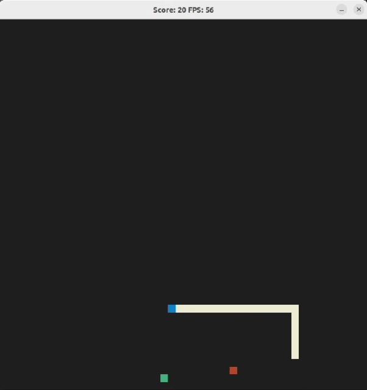

# Snake 2D

Snake 2D is an instance of classical snake game as a part of Udacity's Capstone project. A snake grows by eating food items placed on grid which may be a healthy food (GREEN), poison (RED) or bonus food (YELLOW) which has desired concequences on snake's speed, size and player's highscore. If the snake moves off the grid, it will reappear from the opposite end and dies if it bites its own body. The game score and frame rate is displayed at the title bar of game window.

## Dependencies for Running Locally
* cmake >= 3.7
  * All OSes: [click here for installation instructions](https://cmake.org/install/)
* make >= 4.1 (Linux, Mac), 3.81 (Windows)
  * Linux: make is installed by default on most Linux distros
  * Mac: [install Xcode command line tools to get make](https://developer.apple.com/xcode/features/)
  * Windows: [Click here for installation instructions](http://gnuwin32.sourceforge.net/packages/make.htm)
* gcc/g++ >= 5.4
  * Linux: gcc / g++ is installed by default on most Linux distros
  * Mac: same deal as make - [install Xcode command line tools](https://developer.apple.com/xcode/features/)
  * Windows: recommend using [MinGW](http://www.mingw.org/)
* SDL2 >= 2.0
  * All installation instructions can be found [here](https://wiki.libsdl.org/SDL2/Installation).
  
  Note that for Linux, an `apt` or `apt-get` installation is preferred to building from source.

## Basic Build Instructions

1. Clone this repository.
2. Make a build directory in the top level directory: `mkdir build && cd build`
3. Compile: `cmake .. && make`
4. Run it: `./HelloWorld`.

## Rubic Points

### Compiling and Testing (All Rubric Points REQUIRED)
* The project code compiles and run without errors.

### Loops, Functions, I/O

* The project demonstrates an understanding of C++ functions and control structures.
  * The program uses various kinds of control structures, for instance - while loop (`game.cpp, line 42`), for-each loop (`Renderer::Render(), line 49`), if-else (`game.cpp::UpdateState(), line 132-150`), switch-case (`renderer::Render(), line 51-62`)

* The project reads data from a file and process the data, or the program writes data to a file.
  * `main.cpp, line 60 & 79` - `GetHighScore()` & `SetHighScore()` uses file I/O to read and write highscore on disk.
* The project accepts user input and processes the input.
  * `controller.cpp, line 6` - In Controller::HandleInput(), the program uses SDL library to get user input (key strokes) and sets snake's current direction accordingly.
  * Program performs console I/O and asks for player's name to write highscore. 

### Object Oriented Programming
* The project uses Object Oriented Programming techniques.
  * `game.h, food.h, controller.h, renderer.h` - Header files in this project are organising each component required by the game into different classes (consisting of object attributes as well as associated methods)
* Classes use appropriate access specifiers for class members.
  * The project follows principle of least privilege where data members by default are organized as private members and are only made public if they need to be exposed to the user.
  * Reference - `game.h (class Game)` (both snake and food are organized as private members) whereas in `food.h (class Food)` all members are placed in public section as required by `game.cpp`.
* Class constructors utilize member initialization lists.
  * For instance, `food.h (line 14)` and `game.cpp (line 8-12)` uses initializer lists in constructors to initialize their data members with default values.

### Memory Management
* The project makes use of references in function declarations.
  * `main.cpp`, `line 60 & 69` - GetHighScore() & SetHighScore() takes string and Player objects as references
  * `renderer.cpp, line 38` - Renderer::Render() takes snake and food objects as references.

## Added Features

### High Score Record
Players high score is now being recorded (implemented in `main()`) with player name and score.

### Variety of food items along with their timed placement on grid
There are now 3 kinds of food items - healthy, poisonous and bonus which are placed at random locations for particular time intervals (2-4 seconds). All food items affect current score, snake size and snake speed at the moment.